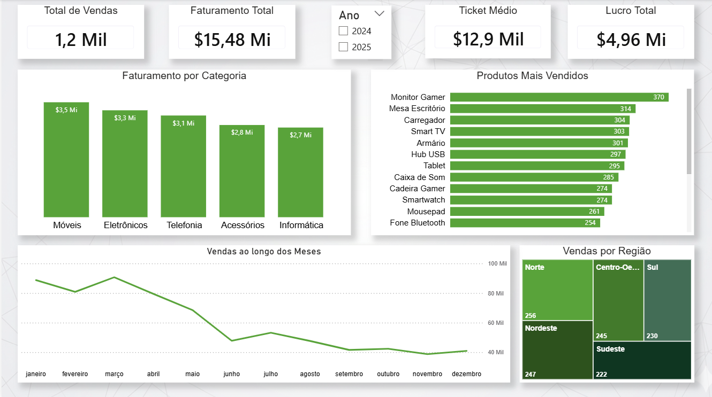

# 📊 Dashboard de Vendas Globais

## 📌 Sobre o projeto
Desenvolvimento de um dashboard de BI no Power BI para análise de faturamento, descontos e eficiência comercial, com foco na geração de insights estratégicos para apoio à tomada de decisão.

## 🛠️ Tecnologias utilizadas
- Power BI  
- Power Query (ETL)  
- DAX  
- Excel  

## 📈 Análises realizadas
- Monitoramento de faturamento total (~12,6 Mi)  
- Análise de impacto de descontos por subcategoria  
- Avaliação de eficiência comercial  
- Identificação de padrões de rentabilidade  

## 💡 Principais insights
- Identificação de concentração de vendas relevante  
- Detecção de possíveis gargalos de rentabilidade na subcategoria “Tables”  
- Impacto dos descontos na performance comercial  

## ⚙️ Destaque técnico
- Tratamento e transformação de dados (ETL) com Power Query  
- Criação de métricas em DAX para análise de variação de descontos  

## ▶️ Como visualizar o projeto
1. Baixe o arquivo `Dashboard de Vendas Globais.pbix`
3. Abra no Power BI Desktop
